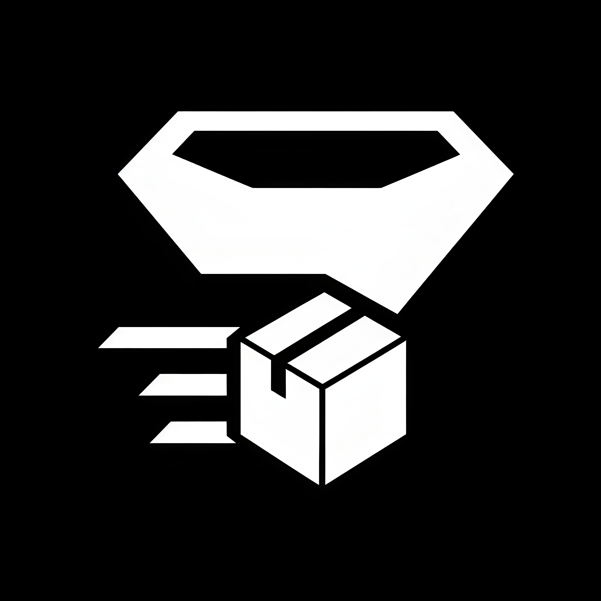
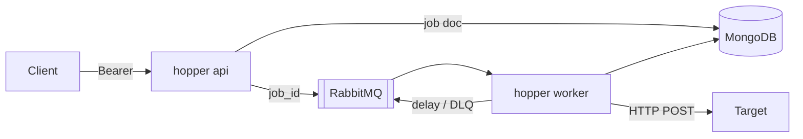

# hopper

<p align="center">
  
</p>

Enqueue a URL and a JSON body. Hopper stores the job in MongoDB, puts `{ "job_id" }` on RabbitMQ, and POSTs until the target accepts — or the job is `dead` and you replay it. At-least-once HTTP only (a crash after 2xx and before Mongo success can duplicate). MVP type: `http_post`.

## Quick start

```bash
docker compose -f deploy/compose.yaml up -d
go build -o hopper ./cmd/hopper
./hopper api     # ingress + outbox relay
./hopper worker  # claim, POST, relay
```

Config example: [`deploy/hopper.example.yaml`](deploy/hopper.example.yaml).

## API

| Method | Path                   |
|:-------|:-----------------------|
| `POST` | `/v1/jobs`             |
| `GET`  | `/v1/jobs/{id}`        |
| `GET`  | `/v1/jobs?status=dead` |
| `POST` | `/v1/jobs/{id}/replay` |
| `GET`  | `/healthz`             |

```http
POST /v1/jobs
Authorization: Bearer <token>
Idempotency-Key: order-42
Content-Type: application/json

{
  "type": "http_post",
  "target": "https://hooks.example.com/notify",
  "payload": { "order_id": 42 },
  "max_attempts": 8
}
```

Outbound: `Idempotency-Key: hopper/{job_id}/{cycle}/{attempt}`.

## Stack

| Role      | Package                                                              |
|:----------|:---------------------------------------------------------------------|
| Language  | [Go 1.27](https://go.dev/doc/go1.27)                                 |
| Router    | [chi](https://pkg.go.dev/github.com/go-chi/chi/v5)                   |
| DI        | [fx](https://pkg.go.dev/go.uber.org/fx)                              |
| Config    | [config](https://pkg.go.dev/go.uber.org/config)                      |
| Log       | [zap](https://pkg.go.dev/go.uber.org/zap)                            |
| Documents | [mongo-driver](https://pkg.go.dev/go.mongodb.org/mongo-driver/v2)    |
| Broker    | [amqp091-go](https://pkg.go.dev/github.com/rabbitmq/amqp091-go)      |
| Egress    | [net/http](https://pkg.go.dev/net/http)                              |

## Non-goals

Exactly-once POST · cron · OAuth/mTLS · K8s/Helm · metrics stack · extra job types (MVP) · retention on by default.

## Flow



## License

[MIT](LICENSE)
