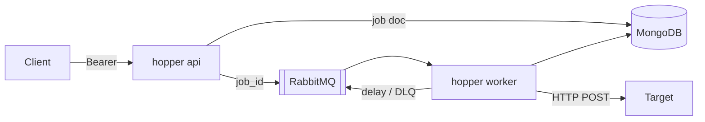

# Hopper

<p align="center">
  
</p>

Hopper is an outbound HTTP worker. You enqueue a URL and a JSON body. The API stores the job in MongoDB, publishes `{ "job_id" }` to RabbitMQ, and a worker POSTs until the target accepts. Exhausted jobs become `dead` and can be replayed.

One binary, two commands: `hopper api` and `hopper worker`. Job type: `http_post`.

Delivery is at-least-once. If the worker dies after a 2xx from the target and before Mongo records the outcome, the next delivery POSTs again. The queue is acked only after that Mongo write (and after the next dispatch intent, when there is one).

## Run

Copy [`deploy/hopper.example.yaml`](deploy/hopper.example.yaml) to gitignored `deploy/hopper.yaml`. Set `api_token` (at least 32 bytes). AMQP credentials must match [`deploy/rabbitmq-definitions.json`](deploy/rabbitmq-definitions.json).

```bash
docker compose -f deploy/compose.yaml up -d
```

Listen address: `http://127.0.0.1:8080` (nginx in front of the API). `GET /healthz` is unauthenticated and returns 200 only when Mongo and RabbitMQ are up.

### Host process

`HOPPER_CONFIG_FILE` is required. The example YAML uses Compose hostnames `mongo` and `rabbitmq`. From the host, use `127.0.0.1:27017` and `127.0.0.1:5672`.

```bash
go build -o hopper ./cmd/hopper
HOPPER_CONFIG_FILE=deploy/hopper.yaml ./hopper api
HOPPER_CONFIG_FILE=deploy/hopper.yaml ./hopper worker
```

## HTTP API

`/v1` requires `Authorization: Bearer <token>`. The per-IP rate limit runs before Bearer. `POST /v1/jobs` requires `Idempotency-Key`.

| Method | Path                     |
| ------ | ------------------------ |
| `POST` | `/v1/jobs`               |
| `GET`  | `/v1/jobs/{id}`          |
| `GET`  | `/v1/jobs?status=dead`   |
| `POST` | `/v1/jobs/{id}/replay`   |
| `GET`  | `/healthz`               |

```http
POST /v1/jobs
Authorization: Bearer <token>
Idempotency-Key: order-42
Content-Type: application/json

{
  "type": "http_post",
  "target": "https://hooks.example.com/notify",
  "payload": { "order_id": 42 },
  "max_attempts": 8
}
```

Outbound `Idempotency-Key` is `hopper/{job_id}/{cycle}/{attempt}`.

Full contract: [`docs/api/openapi.yaml`](docs/api/openapi.yaml).

## Flow



## License

[MIT](LICENSE)
